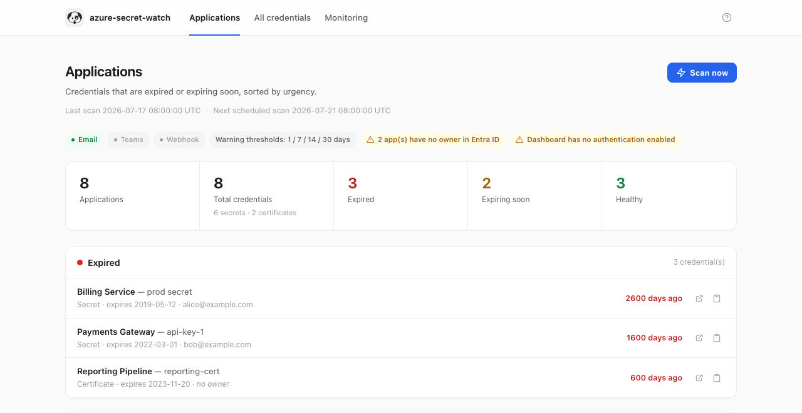
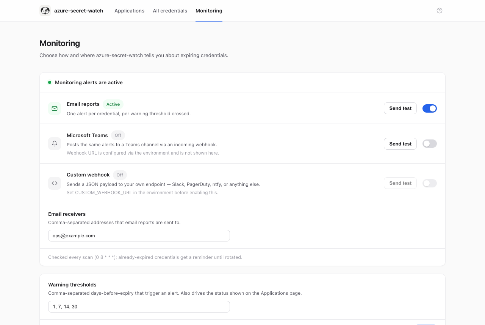

# azure-secret-watch

[English](README.md) | [中文](README.zh-CN.md)

Azure/Microsoft Entra ID 目前**不会**在 App Registration 的客户端密码
(client secret) 或证书到期前发送任何原生提醒 —— 凭据一旦过期，应用直接认证
失败，往往第一次"收到通知"就是生产环境报错。

**azure-secret-watch** 通过 Microsoft Graph API 的只读权限扫描你租户下所有的
App Registration，在密码/证书即将到期前通过邮件、Teams 或 Webhook 提前通知，
让你有时间在出问题之前完成轮换。

## 功能特性

- 🔍 自动扫描所有 App Registration 的 client secret 和证书到期时间
- 📬 支持多种通知渠道：Email / Microsoft Teams / 自定义 Webhook
- ⏰ 可自定义提前提醒天数（如到期前 30/14/7/1 天分级提醒）
- 🔁 自动去重 —— 每个提醒档位只发送一次，已过期的凭据会按设定周期持续提醒，
  直到完成轮换
- 🔒 只读权限接入（`Application.Read.All`），不读取、不记录、不传输密码本身
  （Graph 创建密码后本就不会再返回其明文），不做任何写操作
- 🖥️ 内置 Web 管理面板：可排序/分页的凭据表格、搜索与状态筛选、CSV 导出、
  最近 24 小时的扫描历史记录，并可一键手动触发扫描
- 🧪 每个通知渠道都有"Send test"测试发送按钮，配置好之后可以先验证一下
  Email / Teams / Webhook 是否真的能收到，而不是等真正告警时才发现配错了
- ❓ 内置 **Help** 帮助页面（顶部导航栏的"?"图标），把所有环境变量都整理成
  可折叠的问答形式——本 README 的"配置项"一节内容与它保持一致
- 🐳 单个 Docker Compose 服务即可部署，无需常驻 Logic App 或额外的调度服务器

## 截图

<p>
  
  
</p>

*（以上均为示例数据，非真实租户数据。）*

## 工作原理

1. 使用自己的一个 App Registration（客户端密码或证书）向 Microsoft Graph 认证。
2. 分页调用 `GET /applications`，读取每个应用的 `passwordCredentials` 和
   `keyCredentials` 元数据（key id、描述、起止时间），不会读取密码明文。
3. 计算每个凭据距离到期的天数，与你设置的提醒档位比较。
4. 用本地的小型 SQLite 文件记录哪些"(凭据, 档位)"组合已经提醒过，避免每次
   扫描都重复发送同一档位的提醒。
5. 按已启用的通知渠道，把本次需要关注的凭据汇总成一条通知发出，并附上直达
   Azure 门户对应凭据页面的链接。

## 快速开始（Docker Compose）

### 第一步：为本工具注册一个专用的 App Registration

本工具需要一个自己的身份，并且只授予**只读** Graph 权限：

1. 在 Azure 门户中依次进入 **Microsoft Entra ID → App registrations → New
   registration**，名称和账户类型随意（一般选单租户即可）。
2. 在 **API permissions → Add a permission → Microsoft Graph → Application
   permissions** 中添加：
   - `Application.Read.All`（必需）
   - `User.Read.All`（仅在你打算启用 `NOTIFY_OWNERS` 解析所有者邮箱时需要）
3. 点击 **Grant admin consent** 授予管理员同意 —— Application 权限不同意就
   无法生效。
4. 在 **Certificates & secrets** 中，二选一：
   - **方案 A：客户端密码（Client secret）**——最简单，创建后立即记下值，
     之后无法再次查看。
   - **方案 B：证书（Certificate）**——推荐用于长期运行的部署，因为可以
     避免本工具自己也依赖一个"会过期的密码"这种自相矛盾的情况。上传证书的
     公钥，保留私钥 `.pem` 文件挂载给容器使用。
5. 从应用的 Overview 页面记下 **Application (client) ID** 和
   **Directory (tenant) ID**。

### 第二步：配置并启动

```bash
git clone <this repo>
cd azure-secret-watch
cp .env.example .env
# 编辑 .env：填写 AZURE_TENANT_ID / AZURE_CLIENT_ID / AZURE_CLIENT_SECRET
# （或 AZURE_CLIENT_CERTIFICATE_PATH），并至少启用一个通知渠道
# （邮件 / Teams / Webhook）。

docker compose up -d
```

容器会持续运行，并按 `CRON_SCHEDULE` 设定的时间扫描（默认每天 UTC 08:00），
另外启动时也会立即跑一次（`RUN_SCAN_ON_STARTUP=true` 默认开启）。状态数据
（去重数据库、最近一次运行结果）持久化在 `./data` 目录下。

打开 **http://localhost:8080** 即可访问 Web 管理面板 —— 展示所有已扫描凭据
及其到期状态的表格，支持搜索/筛选，并有"立即扫描"按钮。面板只展示凭据元数据
（名称、key id、到期时间），永远不会显示密码或证书明文。

如果想在等待调度之前先手动跑一次测试：

```bash
docker compose run --rm azure-secret-watch python -m azure_secret_watch --once
```

建议第一次运行时设置 `DRY_RUN=true`——会把本应发送的内容打印到日志，但不会
真正发出通知，也不会更新去重状态。

### 使用外部调度而非内置循环

如果你更倾向于用宿主机 cron、systemd 或 Kubernetes CronJob 来触发扫描，可以
使用 `docker-compose.once.yml`（设置了 `RUN_MODE=once`，容器扫描一次后退出）：

```bash
docker compose -f docker-compose.once.yml run --rm azure-secret-watch
```

## 配置项

所有配置都是 `.env` 里的环境变量——这些值可能包含密钥，所以都不会在网页里
填写。这一节的内容和 Web 面板里内置的 **Help** 帮助页面（顶部导航栏的"?"
图标）保持一致，那里把同样的变量整理成了可折叠的问答形式。改完 `.env` 后
用 `docker compose up -d` 应用；通知渠道配置好之后，去 Monitoring 页面点
**Send test** 按钮验证一下真的能收到，而不是等真正告警时才发现配错了。

### Azure AD 认证（必填）

1. 在 Microsoft Entra ID 里为本工具注册一个专用的 App Registration。
2. 授予它 **application** 权限 `Application.Read.All`（Microsoft Graph），
   然后点击 **Grant admin consent**。
3. 如果你打算启用下面的 `NOTIFY_OWNERS`，还需要额外授予 `User.Read.All`
   以便解析所有者邮箱。

本工具只会发起 Graph 的 `GET` 请求——读不到密码明文（Graph 创建后本就不会
再返回），也不会修改任何东西。

**方案 A —— 客户端密码（最简单）**

```env
AZURE_TENANT_ID=<你的 tenant ID>
AZURE_CLIENT_ID=<这个 App Registration 的 client ID>
AZURE_CLIENT_SECRET=<为它创建的客户端密码>
```

这意味着本工具自己的访问权限也依赖一个终将过期的密码——记得给自己设个日历
提醒，或者优先选方案 B（适合长期运行的部署）。

**方案 B —— 客户端证书（推荐用于长期部署）**

```env
AZURE_CLIENT_CERTIFICATE_PATH=/certs/watcher.pem
AZURE_CLIENT_CERTIFICATE_PASSWORD=
```

把你的 `.pem`（私钥 + 证书链）挂载进容器——参见 `docker-compose.yml` 里的
`./certs` 卷——就不用再设置 `AZURE_CLIENT_SECRET` 了。

### 扫描行为

```env
WARNING_THRESHOLDS_DAYS=30,14,7,1
INCLUDE_SECRETS=true
INCLUDE_CERTIFICATES=true
EXPIRED_REMINDER_INTERVAL_DAYS=7
NOTIFY_OWNERS=false
```

- `WARNING_THRESHOLDS_DAYS` —— 逗号分隔的"到期前多少天"提醒档位；后续也可以
  在 Monitoring 页面直接修改。
- `INCLUDE_SECRETS` / `INCLUDE_CERTIFICATES` —— 扫描哪些凭据类型。
- `EXPIRED_REMINDER_INTERVAL_DAYS` —— 已经过期、还没轮换的凭据，间隔多少天
  重新提醒一次。
- `NOTIFY_OWNERS` —— 通过 `/applications/{id}/owners` 查询每个应用的所有者，
  并在面板和通知里展示（需要上面提到的 `User.Read.All` 权限）。这是 Entra ID
  里真实的所有者关系，不是本工具凭空生成或代替你分配的——确实没有所有者的
  应用会被标记为"无所有者"，并在顶部用提示标签汇总数量。

### 调度

```env
RUN_MODE=loop
CRON_SCHEDULE=0 8 * * *
RUN_SCAN_ON_STARTUP=true
```

- `RUN_MODE=loop`（默认）—— 容器持续运行，按 `CRON_SCHEDULE`（标准 5 段式
  cron 语法，按 UTC 计算）扫描。
- `RUN_MODE=once` —— 只扫描一次然后退出；如果你想用宿主机 cron、systemd 或
  Kubernetes CronJob 自己控制调度，用这个（参见 `docker-compose.once.yml`）。
- `RUN_SCAN_ON_STARTUP` —— 容器启动时额外立即扫描一次（仅 loop 模式），这样
  面板马上就有数据，不用等第一次定时扫描。

### Web 面板与访问控制

```env
WEB_UI_ENABLED=true
WEB_UI_HOST=0.0.0.0
WEB_UI_PORT=8080
WEB_UI_USERNAME=
WEB_UI_PASSWORD=
```

`WEB_UI_USERNAME` 和 `WEB_UI_PASSWORD` 默认都是空的，也就是说**任何能访问到
这个端口的人都能看到所有凭据的状态、还能触发扫描——不需要登录**。把这两个都
填上就会给整个面板开启 HTTP Basic Auth（浏览器原生的用户名/密码弹窗，不是网页
里的表单），填完后 `docker compose up -d` 应用。不管有没有开认证，面板都只
展示名称、key id 和到期时间，不会显示密码或证书明文——但它确实会暴露你的
App Registration 清单，仍然值得做好访问控制。设置 `WEB_UI_ENABLED=false`
可以完全禁用面板。

### 存储与高级选项

大部分情况下用 `docker-compose.yml` 里的默认值就行，不需要改。

- `STATE_DB_PATH`、`STATUS_FILE_PATH`、`INVENTORY_FILE_PATH`、
  `SCAN_HISTORY_FILE_PATH`、`SETTINGS_FILE_PATH` —— 各类持久化数据在容器内
  的存放路径，都在 `/data` 下，已经映射到 `./data` 卷。这些文件和任何日志
  输出一样，都不会包含真实的密码明文或证书私钥。
- `SCAN_HISTORY_LIMIT` —— 面板"扫描历史"面板保留的最近 24 小时窗口内，最多
  能堆积的记录条数上限（超过 24 小时的记录会自动清理）。
- `DRY_RUN` —— 只把本应发送的内容打印到日志，不会真正发送，也不会更新去重
  状态；适合第一次试运行。
- `LOG_LEVEL` —— 标准 Python 日志级别（`INFO`、`DEBUG`、`WARNING` 等）。
- `GRAPH_PAGE_SIZE` / `REQUEST_TIMEOUT_SECONDS` —— 调用 Microsoft Graph 的
  分页大小和请求超时时间；默认值对绝大多数租户都够用。

### Email（SMTP）

```env
NOTIFY_EMAIL_ENABLED=true
SMTP_HOST=smtp.example.com
SMTP_PORT=587
SMTP_USERNAME=
SMTP_PASSWORD=
SMTP_USE_TLS=true
EMAIL_FROM=azure-secret-watch@example.com
EMAIL_TO=ops@example.com, secops@example.com
```

`EMAIL_TO` 是一个固定的收件人列表（比如你的运维/安全团队）——所有告警邮件
都会发给这几个地址，**不是**按应用所有者分别路由：如果开启了
`NOTIFY_OWNERS`，每个应用的所有者会显示在邮件正文里供参考（方便你知道该找
谁），但不会被当作单独的收件人。

### Microsoft Teams

1. 在 Teams 左侧应用栏搜索并打开 **Workflows** 应用（不是频道里加的
   "Power Automate" 标签页——不需要先进某个频道）。
2. 搜索模板 **"Send webhook alerts to a chat"**，或者用同样的触发器 +
   "Post card in a chat or channel" 动作手动搭一个空白 flow（原因见下方
   备注）。
3. 在向导里选好要发送到的聊天或频道，完成设置。
4. 复制生成的 HTTP POST URL——这就是你的 webhook 地址。

```env
NOTIFY_TEAMS_ENABLED=true
TEAMS_WEBHOOK_URL=<你复制的 URL>
TEAMS_WEBHOOK_FORMAT=adaptive_card
```

`TEAMS_WEBHOOK_FORMAT` 默认是 `adaptive_card`，对应上面用 Workflows 建的
webhook；只有你用的是旧版 Office 365 Connector webhook 时才需要改成
`messagecard`。

一个 webhook URL 只绑定创建它时选的那一个聊天/频道。如果还想发到别的地方，
需要另外建一个 flow、拿一个新的 URL——目前本工具一次只能发送到一个 Teams
目的地。

如果不想让 Teams 在每条消息下面显示"used a Workflow template… Get
template"这行字，可以不用模板库，改成从**空白画布**手动搭建同样的触发器 +
"Post card in a chat or channel"动作——这行提示是 Teams 根据 flow 的创建
方式自动加的，不是本工具发送内容的一部分。

### 自定义 Webhook

```env
NOTIFY_WEBHOOK_ENABLED=true
CUSTOM_WEBHOOK_URL=https://your-endpoint.example.com/hook
CUSTOM_WEBHOOK_METHOD=POST
CUSTOM_WEBHOOK_HEADERS={"Authorization": "Bearer <token>"}
```

`CUSTOM_WEBHOOK_HEADERS` 是可选的——一个 JSON 格式的额外请求头对象，最常见
的用途是给目标端点传 Bearer Token 或 API Key。

请求体格式：

```json
{
  "summary": {"total": 2, "expired": 1, "expiring_soon": 1},
  "alerts": [
    {
      "severity": "expired",
      "app_display_name": "Billing Service",
      "credential_type": "secret",
      "credential_display_name": "prod secret",
      "days_until_expiry": -3,
      "owners": ["alice@example.com"],
      "portal_url": "https://portal.azure.com/..."
    }
  ]
}
```

这是一个通用的、跟具体平台无关的格式——不是 Slack 或 PagerDuty 自己的消息
格式。如果目标系统需要它自己的格式，中间加一层转发（Power Automate flow、
Zapier 的"Catch Hook"、或者你自己的一个小接口）把这段 JSON 转换一下再转发
过去即可。

## 开发

运行测试、lint 以及本地构建镜像的方法见 [CONTRIBUTING.md](CONTRIBUTING.md)。

## 许可证

[MIT](LICENSE)
